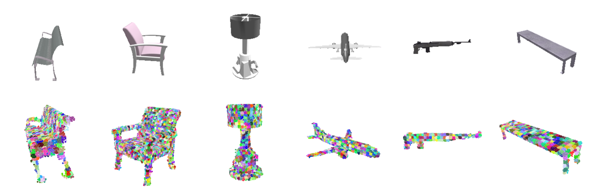

# UCLID-Net: Single View Reconstruction in Object Space

This repository is the official implementation of [UCLID-Net: Single View Reconstruction in Object Space (NeurIPS 2020)](https://arxiv.org/abs/2006.03817). 



Code contact: [Benoit Guillard](https://people.epfl.ch/benoit.guillard)

## Requirements

This code was tested on Ubuntu 18.04.3 LTS with CUDA 10.2 and PyTorch 1.2.0. We provide an environment description file to directly set up a conda env with:

```setup
conda env create -f conda_env.yml
conda activate uclidnet
```

To compile required CUDA kernels for Chamfer distance (credits to [Thibault Groueix](https://github.com/ThibaultGROUEIX/ChamferDistancePytorch)) and grid pooling, please do:
```setup
cd extensions
python setup.py install --user
```

Optionally, training metrics are tracked using [Weights & Biases](https://www.wandb.com/) if a correct installation is detected.

## Datasets and Pre-trained Models

Instructions to get datasets to place in the ``data/`` directory are provided [here](data/README.md). We also provide trained networks to place in the ``trained_models/`` directory as explained [here](trained_models/README.md).

## Training and Evaluation of the main model

To train a UCLID-Net model, run ``train_UCLID_Net.py``, using the ``--test_split`` and ``--train_split`` options. We provide splits for the car category, and for the 13 main categories of ShapeNet in ``data/splits/``. For example, to train a model on the car subset, run:

```train
python train_UCLID_Net.py --train_split data/splits/cars_train.json --test_split data/splits/cars_test.json
```
Hyperparameters are already set to their default value used in the main paper. Outputs (trained network, logfile and prediction samples) are stored in the ``output/`` directory.

To evaluate the network, run ``test_UCLID_Net.py`` specifying the path to the trained weights using the ``--model`` option. For example, using the [provided trained model](trained_models/README.md) on all categories
```eval
python test_UCLID_Net.py --test_split data/splits/all_13_classes_test.json --model trained_models/UCLID_Net_all_classes.pth
```
should approximately give the following metrics
| Chamfer | Shell IoU | F-score @5% |
|---------|-----------|-------------|
|   6.5   |    37%    |    95.4%    |


> The small discrepancy with metrics reported in the paper is due to the fact we here evaluate on our own ShapeNet RGB renderings, which have different random viewpoints as the ones provided by the authors of [DISN](https://github.com/laughtervv/DISN). Latter renderings were used in the main paper.

In addition to computing metrics, the evaluation script also outputs reconstructed 3D points clouds for 10 instances of each category. These are to be found in a directory named after the trained model's weights file (``trained_models/UCLID_Net_all_classes/`` in the above example).

## Auxiliary Networks: Depth and Camera regressions
We provide the architectures, trained weights and training scripts for both auxiliary networks regressing depthmaps and cameras. They can respectively be trained using ``train_image2depth.py`` and ``train_image2camera.py``. Depth estimation mainly comes from Haofeng Chen's [awesome work](https://github.com/haofengac/MonoDepth-FPN-PyTorch).

Once trained, use ``generate_image2depth.py`` and ``generate_image2camera.py`` to regress depth and pose for all views of the dataset. For example, the following will generate cameras for all views of the 13 shapes categories using the provided pre-trained model, and store them in data/newly_inferred_camera :

```generate
python generate_image2camera.py --model trained_models/image2cam_all_classes.pth --test_split data/splits/all_13_classes_test.json --train_split data/splits/all_13_classes_train.json  --output_dir data/newly_inferred_camera
```

These depthmaps and camera poses can be used for testing/training a UCLID-Net model in place of the ground truth ones, as described [here](data/README.md#choose-data-source-for-trainingtesting).
